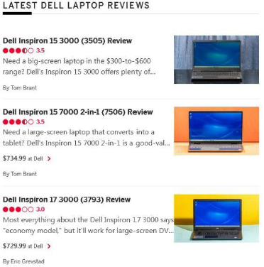
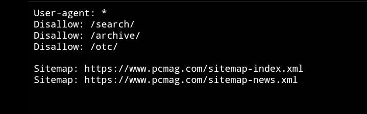
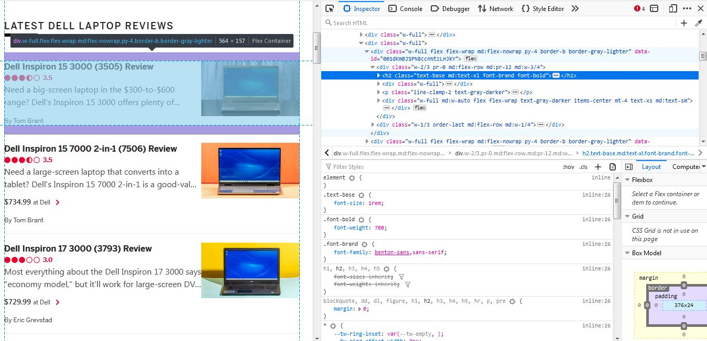
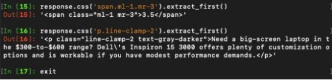
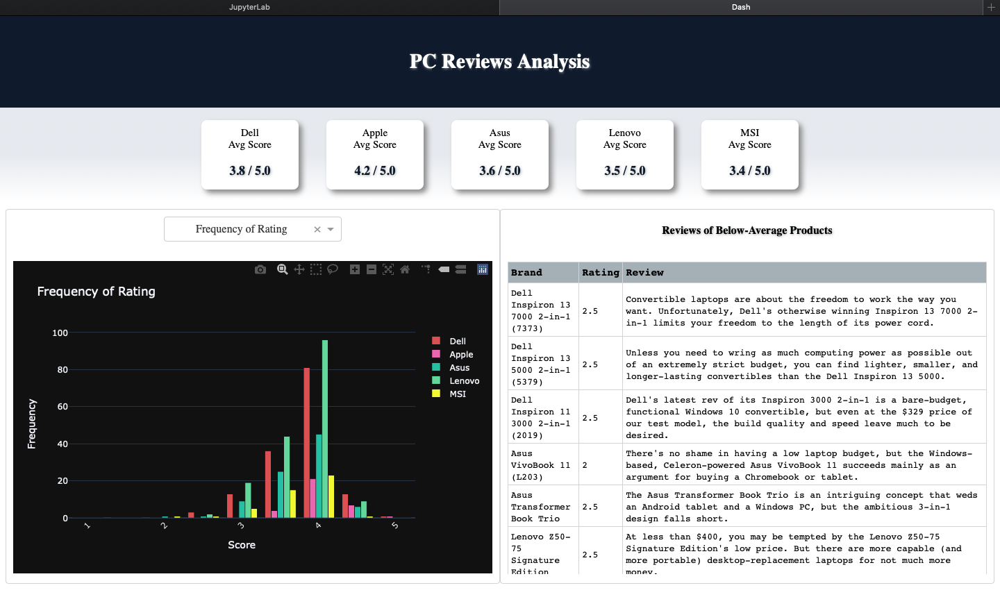
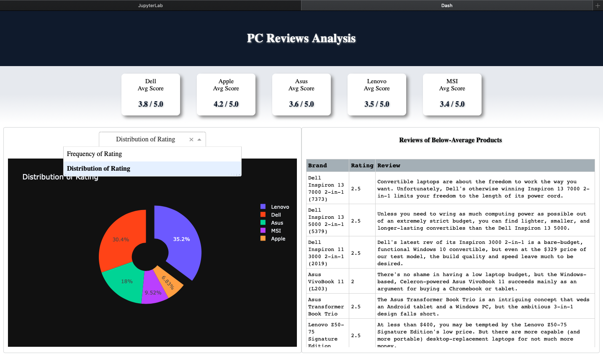

# Introduction
In the era of big data, loads of manual work need to be done in order to collect the necessary data on a large scale, at the speed of light and at no cost. Data analysis or prediction could be performed for business plans and more. In this mini project, *pcmag.com* will be the chosen website to compare the reviews of different pc brands.

 

<br/>
<br/>

# A Simple Application
My very first time using Scrapy and Dash.

### Overview
Customer reviews are collected from a website using Scrapy. The data is then visualised and displayed on a simple web application built with Dash framework. Jupyter Lab is used.

### Scrapy
A Python library for web scraping

### Dash
A Python framework built on top of Flask, Plotly.js, React and React.js 

<br />

How to run the project on your local machine

```
% cd *project directory*
% source env/bin/activate
% jupyter lab
```

Run all the cells in `dashboard-app.ipynb`. Access the application on 127.0.0.1:8050 

<br />
How to quit

```
% Ctrl + c
% y
% deactivate
```

<br/>
<br/>

# Web Scraping Part
Beautifulsoup could be considered as well for this simple static web page (but I personally want to practise using Scrapy) 😀

<br/>

First and foremost, respect the owner/author of the page, check whether this site can be scrapped. Simply type domain name followed by robots.txt in the browser. <br/>


In this case, directories with ‘/search/’, ‘/archive/’ and ‘/otc/’ are not allowed to be scrapped. <br/>



<br/>
<br/>

There is a sample spider that performs scraping on the chosen website for a particular brand. This file could be found in `./pcreviews/spiders/applespider.py`. To perform web scraping, knowledge of XML or CSS selector will be needed. In this project, all the data obtained by the spider will be saved as .csv files which could be found in `./pcreviews/`. <br/>



<br/>

Scrapy shell <br/>



<br/>
<br/>

# Application Part
The interactive plot is built with Plotly. <br/>
3 pillars of Dash App
* Component
* Plotly
* Callback


# Output
Screenshot of the application <br/>

 

With some interactivity (PS: The table is scrollable) <br/>

 

## Discussion
* External styles instead of inline styles
